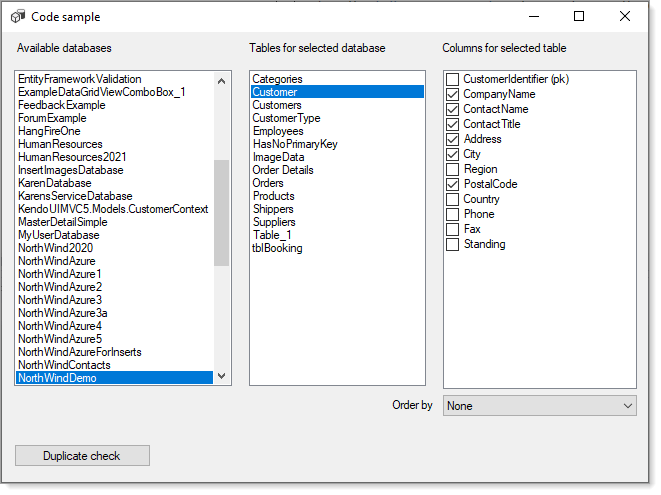
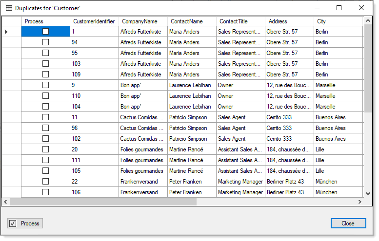

# About

TechNet article [SQL-Server- C# Find duplicate record with identity](https://social.technet.microsoft.com/wiki/contents/articles/51628.sql-server-c-find-duplicate-record-with-identity.aspx) 

New Solutions (application) with a database setup for the solution involving data are commonly read and written to outside of the solution. 

When these databases are not properly setup with constraints at the database level and with proper constraints in the solution there can be the possibility of duplicate records generated. New solutions (applications) written to read and write from existing databases that have not been setup with constraints and perhaps older solutions without proper constraints may have duplicate records.

A database without a solution is not immune from having duplicate records.

The [article](https://social.technet.microsoft.com/wiki/contents/articles/51628.sql-server-c-find-duplicate-record-with-identity.aspx) will provide a user interface which displays a databases, their tables and columns for the tables  in a specific database were the user can select a table, check off columns to determine if there are duplicate records that provide the primary key (all tables should have a primary key) so that a DELETE FROM statement can be generated to removed records. The user is presented with duplicate records in a DataGridView with a DataGridViewCheckBox column. Check one or more records, press a button and a SELECT FROM statement is generated.

 

:green_circle: See the [following repository](https://github.com/karenpayneoregon/WorkingWithCollections) for working with collections.